# RegShield: Blockchain-Powered Vehicle Rental Investment Platform

[](https://chain.link/cre)
[](https://erc3643.org/)
[](https://worldcoin.org/world-id)
[](https://opensource.org/licenses/MIT)

**RegShield** is a fully on-chain vehicle rental investment platform where vehicle operators (rentors) raise capital by tokenizing vehicle ownership and rental income rights using **ERC-3643** security tokens. Investors fund vehicle acquisitions, renters book vehicles with crypto payments, and rental revenue is automatically distributed via a transparent **waterfall model** — all orchestrated by **5 Chainlink CRE workflows** that automate compliance, onboarding, payments, vehicle telematics, and campaign monitoring.

> **Chainlink Convergence Hackathon 2026** - DeFi & Tokenization

---

## Key Features

- **Chainlink CRE Automation**: 5 off-chain workflows automate the entire platform lifecycle — from investor onboarding to revenue distribution
- **ERC-3643 Security Tokens**: Dual-token model per vehicle (AssetToken for ownership, RevenueToken for income rights) with full KYC/AML enforcement
- **On-Chain Compliance Stack**: IdentityRegistry, ComplianceRules, RenterCompliance, OperationalCompliance, TransferRestrictions — all enforced at the smart contract level
- **World ID Integration**: Sybil-resistant identity verification via Worldcoin zero-knowledge proofs
- **Milestone-Based Escrow**: 4-stage investment release (Vehicle Identified → Purchase Verified → Insurance Obtained → Registration Completed) with external API validation via CRE
- **Revenue Waterfall**: Automated rental income distribution — 15% platform, 10% maintenance, 25% operator (rentor), 50% to investors (pro-rata via dividend-per-share accumulator)
- **Vehicle NFTs (ERC-721)**: Each physical vehicle is represented as an NFT with VIN, maintenance history, incident records, and linked security tokens
- **Multi-Sig Investor Wallets**: Auto-created on approval for additional investment security
- **Crypto Rental Payments**: ETH-based rental payments with escrow, dispute resolution, and refund management

---

## Architecture

```
┌─────────────────────────────────────────────────────────────────────────────┐
│                        Chainlink CRE Workflows (Off-Chain)                  │
│                                                                             │
│  ┌──────────────────┐  ┌──────────────────┐  ┌──────────────────────────┐   │
│  │ Onboarding       │  │ Payment          │  │ Vehicle Telematics       │   │
│  │ Workflow         │  │ Workflow         │  │ Workflow                 │   │
│  │ Auto-approve     │  │ Milestone        │  │ Mileage updates,         │   │
│  │ investors &      │  │ verification via │  │ incident detection,      │   │
│  │ bookings         │  │ NHTSA VIN API    │  │ maintenance tracking     │   │
│  └────────┬─────────┘  └────────┬─────────┘  └───────────┬──────────────┘   │
│           │                     │                        │                  │
│  ┌────────┴─────────┐   ┌───────┴──────────┐                                │
│  │ Compliance       │   │ Campaign         │                                │
│  │ Workflow         │   │ Monitor Workflow │                                │
│  │ Registration &   │   │ Failed campaign  │                                │
│  │ insurance expiry,│   │ detection &      │                                │
│  │ blacklisting     │   │ batch refunds    │                                │
│  └────────┬─────────┘   └───────┬──────────┘                                │
└───────────┼─────────────────────┼────────────────────────┼──────────────────┘
            │                     │                        │
            ▼                     ▼                        ▼
┌──────────────────────────────────────────────────────────────────────────────┐
│                     CRE Receiver Contracts (On-Chain)                        │
│                                                                              │
│  OnboardingReceiver  PaymentReceiver  VehicleReceiver                        │
│  ComplianceReceiver  CampaignMonitorReceiver                                 │
└──────────────────────────────────────────────────────────────────────────────┘
            │                     │                        │
            ▼                     ▼                        ▼
┌──────────────────────────────────────────────────────────────────────────────┐
│                        Smart Contract Layer (Sepolia)                        │
│                                                                              │
│  ┌─────────────────────────────────────────────────────────────────────────┐ │
│  │  ERC-3643 Token Layer                                                   │ │
│  │  AssetToken (Ownership) + RevenueToken (Income Rights) + TokenFactory   │ │
│  │  IdentityRegistry + TrustedIssuersRegistry + ClaimTopicsRegistry        │ │
│  │  ComplianceRules + InvestorTypeCompliance + TransferRestrictions        │ │
│  └─────────────────────────────────────────────────────────────────────────┘ │
│  ┌─────────────────────────────────────────────────────────────────────────┐ │
│  │  OnchainID Identity Layer (ERC-734 / ERC-735)                           │ │
│  │  OnchainID + ClaimIssuer + KeyManager + OnchainIDFactory                │ │
│  │  WorldIDVerifier (Sybil Resistance)                                     │ │
│  └─────────────────────────────────────────────────────────────────────────┘ │
│  ┌─────────────────────────────────────────────────────────────────────────┐ │
│  │  Vehicle & Rental System                                                │ │
│  │  VehicleNFT (ERC-721) + RentalBooking + RentalOperations                │ │
│  │  RenterCompliance + OperationalCompliance                               │ │
│  └─────────────────────────────────────────────────────────────────────────┘ │
│  ┌─────────────────────────────────────────────────────────────────────────┐ │
│  │  Payment & Revenue System                                               │ │
│  │  RegShieldPaymentProtocol + RentalPaymentProtocol                       │ │
│  │  PaymentEscrow + RefundManager + DisputeResolver                        │ │
│  │  RevenueDistributor (Waterfall Model)                                   │ │
│  └─────────────────────────────────────────────────────────────────────────┘ │
│  ┌─────────────────────────────────────────────────────────────────────────┐ │
│  │  Investor Management                                                    │ │
│  │  InvestorRequestManager + MultiSigWallet                                │ │
│  └─────────────────────────────────────────────────────────────────────────┘ │
└──────────────────────────────────────────────────────────────────────────────┘
            │
            ▼
┌──────────────────────────────────────────────────────────────────────────────┐
│  Frontend (Next.js 16) + Backend (Express.js 5 + MongoDB)                    │
│  Wagmi v3 + Viem v2 | Zustand | Thirdweb | WalletConnect                     │
└──────────────────────────────────────────────────────────────────────────────┘
```

---

### Key Data Flows

| User Type    | Key Actions                                     | Data Flow Path                                                                                              |
| ------------ | ----------------------------------------------- | ----------------------------------------------------------------------------------------------------------- |
| **Renter**   | Browse vehicles, book, pay, complete rental     | Frontend → Backend (vehicle list) → Frontend → Smart Contract (RentalBooking) → Onboarding CRE              |
|              | Submit damage reports                           | Frontend → Backend (incident log) → Vehicle CRE → VehicleReceiver → VehicleNFT                              |
| **Investor** | Browse campaigns, request access, fund, claim   | Frontend → Smart Contract (InvestorRequestManager) → Onboarding CRE → OnboardingReceiver → IdentityRegistry |
|              | Trade tokens (AssetToken/RevenueToken)          | Frontend → Smart Contract (Token.transfer) → ComplianceRules (ERC-3643 checks) → TransferRestrictions       |
| **Rentor**   | Add vehicle, create campaign, submit milestones | Frontend → Backend (metadata) → Smart Contract (VehicleNFT mint) → Frontend (campaign creation)             |
|              | Complete milestones (insurance, registration)   | Frontend → Backend (proof upload) → Payment CRE → NHTSA API validation → PaymentReceiver → Escrow release   |
|              | Withdraw operator fees                          | Frontend → Smart Contract (RevenueDistributor.withdrawOperatorFees) → ETH transfer                          |

### Cross-Layer Interactions

1. **On-Chain ↔ Off-Chain Sync**: CRE workflows read blockchain events (via RPC) and submit verified reports back to receiver contracts
2. **Frontend ↔ Backend**: Next.js fetches off-chain metadata (vehicle images, descriptions, KYC docs) from Express API + MongoDB
3. **Frontend ↔ Blockchain**: Wagmi hooks enable direct smart contract reads/writes via Viem RPC provider
4. **Backend ↔ Blockchain**: Express server monitors events (using `viem.watchEvent`) to update MongoDB with latest on-chain state

---

## Interactive DFD

This interactive diagram renders on GitHub/GitLab and can be explored dynamically:

```mermaid
graph TB
    %% User Layer
    subgraph Users["👥 Platform Users"]
        Renter["🚗 RENTER<br/>Vehicle User<br/>────────<br/>• Browse vehicles<br/>• Submit booking<br/>• Pay rental fee<br/>• Complete rental"]
        Investor["💰 INVESTOR<br/>Capital Provider<br/>────────<br/>• Browse campaigns<br/>• Request investment<br/>• Fund campaign<br/>• Claim revenue<br/>• Trade tokens"]
        Rentor["🏢 RENTOR<br/>Vehicle Operator<br/>────────<br/>• Add vehicle<br/>• Create campaign<br/>• Submit milestones<br/>• Withdraw fees<br/>• Manage bookings"]
    end

    %% Frontend Layer
    subgraph Frontend["⚛️ Frontend Layer - Next.js 16 + React 19"]
        RenterPortal["Renter Portal"]
        InvestorPortal["Investor Portal"]
        RentorPortal["Rentor Portal"]
        AdminPortal["Admin Portal"]
        Web3Libs["Web3 Stack<br/>────────<br/>Wagmi v3 | Viem v2<br/>Zustand | TanStack Query<br/>Thirdweb | WalletConnect"]
    end

    %% Backend Layer
    subgraph Backend["🖥️ Backend Layer - Express.js 5 + MongoDB"]
        APIRoutes["API Routes<br/>────────<br/>/api/vehicles<br/>/api/campaigns<br/>/api/bookings<br/>/api/auth<br/>/api/investors"]
        MongoDB["MongoDB Database<br/>────────<br/>• Vehicle metadata<br/>• Campaign details<br/>• Booking history<br/>• User profiles KYC<br/>• Revenue records"]
    end

    %% Smart Contract Layer
    subgraph Blockchain["⛓️ Blockchain Layer - Ethereum Sepolia"]
        subgraph TokenLayer["ERC-3643 Token Layer"]
            AssetToken["AssetToken<br/>RevenueToken"]
            IdentityReg["IdentityRegistry"]
            Compliance["ComplianceRules<br/>TransferRestrictions"]
        end

        subgraph IdentityLayer["Identity Layer ERC-734/735"]
            OnchainID["OnchainID<br/>ClaimIssuer"]
            WorldID["WorldIDVerifier"]
        end

        subgraph VehicleLayer["Vehicle & Rental System"]
            VehicleNFT["VehicleNFT ERC-721"]
            RentalBooking["RentalBooking<br/>RentalOperations"]
            RenterComp["RenterCompliance<br/>OperationalCompliance"]
        end

        subgraph PaymentLayer["Payment & Revenue System"]
            PaymentProto["PaymentProtocol<br/>PaymentEscrow"]
            RefundMgr["RefundManager<br/>DisputeResolver"]
            RevenueDist["RevenueDistributor"]
        end

        subgraph InvestorLayer["Investor Management"]
            InvestorMgr["InvestorRequestManager<br/>MultiSigWallet"]
        end
    end

    %% CRE Receiver Layer
    subgraph CREReceivers["🔗 CRE Receiver Contracts - Bridge: Off-Chain → On-Chain"]
        OnboardingRcv["OnboardingReceiver"]
        PaymentRcv["PaymentReceiver"]
        VehicleRcv["VehicleReceiver"]
        ComplianceRcv["ComplianceReceiver"]
        CampaignRcv["CampaignMonitorReceiver"]
    end

    %% Chainlink CRE Layer
    subgraph ChainlinkCRE["⚡ Chainlink CRE - Off-Chain Compute with DON Consensus"]
        subgraph OnboardingWF["Onboarding Workflow"]
            OnbActions["• Read investor requests<br/>• Validate identity World ID<br/>• Auto-approve/reject<br/>• Read pending bookings<br/>• Validate renter compliance<br/>• Auto-approve/reject booking"]
        end

        subgraph PaymentWF["Payment Workflow"]
            PayActions["• Verify milestones via API<br/>  ├─ VEHICLE_IDENTIFIED<br/>  │  NHTSA VIN Decoder API<br/>  ├─ PURCHASE_VERIFIED<br/>  ├─ INSURANCE_OBTAINED<br/>  └─ REGISTRATION_COMPLETED<br/>• Trigger escrow release"]
        end

        subgraph VehicleWF["Vehicle Workflow"]
            VehActions["• Monitor mileage odometer<br/>• Record incidents<br/>• Track maintenance"]
        end

        subgraph ComplianceWF["Compliance Workflow"]
            CompActions["• Check registration expiry<br/>• Check insurance expiry<br/>• Suspend non-compliant<br/>• Blacklist risky renters"]
        end

        subgraph CampaignWF["Campaign Monitor Workflow"]
            CampActions["• Detect failed campaigns<br/>• Trigger batch refunds<br/>• Handle cancellations"]
        end
    end

    %% User to Frontend Connections
    Renter --> RenterPortal
    Investor --> InvestorPortal
    Rentor --> RentorPortal

    RenterPortal --> Web3Libs
    InvestorPortal --> Web3Libs
    RentorPortal --> Web3Libs
    AdminPortal --> Web3Libs

    %% Frontend to Backend (API Calls)
    Web3Libs -->|"REST API Requests<br/>Vehicle metadata, KYC docs"| APIRoutes
    APIRoutes --> MongoDB
    MongoDB -->|"Off-chain data enrichment"| VehicleNFT

    %% Frontend to Blockchain (Web3 RPC)
    Web3Libs -->|"Web3 RPC Calls via Viem<br/>Direct smart contract reads/writes"| TokenLayer
    Web3Libs --> IdentityLayer
    Web3Libs --> VehicleLayer
    Web3Libs --> PaymentLayer
    Web3Libs --> InvestorLayer

    %% Smart Contract Events to CRE Receivers
    TokenLayer -->|"Emit Events<br/>TokensMinted, TransferBlocked"| OnboardingRcv
    PaymentLayer -->|"FundsReceived, MilestoneCompleted"| PaymentRcv
    VehicleLayer -->|"VehicleRegistered, BookingCreated"| VehicleRcv
    RenterComp -->|"ComplianceViolation, VehicleSuspended"| ComplianceRcv
    InvestorMgr -->|"CampaignFailed, RefundRequired"| CampaignRcv

    %% CRE Receivers to Workflows
    OnboardingRcv -.->|"Read blockchain state"| OnbActions
    PaymentRcv -.->|"Read blockchain state"| PayActions
    VehicleRcv -.->|"Read blockchain state"| VehActions
    ComplianceRcv -.->|"Read blockchain state"| CompActions
    CampaignRcv -.->|"Read blockchain state"| CampActions

    %% Workflows back to Receivers (Reports)
    OnbActions -->|"Submit verified reports"| OnboardingRcv
    PayActions -->|"Submit verified reports"| PaymentRcv
    VehActions -->|"Submit verified reports"| VehicleRcv
    CompActions -->|"Submit verified reports"| ComplianceRcv
    CampActions -->|"Submit verified reports"| CampaignRcv

    %% External Integrations
    PayActions -->|"External API Call"| NHTSA["NHTSA VIN Decoder API"]

    %% Styling
    classDef userClass fill:#000000,stroke:#0288d1,stroke-width:2px
    classDef frontendClass fill:#000000,stroke:#f57c00,stroke-width:2px
    classDef backendClass fill:#000000,stroke:#7b1fa2,stroke-width:2px
    classDef blockchainClass fill:#000000,stroke:#388e3c,stroke-width:2px
    classDef creClass fill:#000000,stroke:#f9a825,stroke-width:2px
    classDef receiverClass fill:#000000,stroke:#c2185b,stroke-width:2px

    class Renter,Investor,Rentor userClass
    class RenterPortal,InvestorPortal,RentorPortal,AdminPortal,Web3Libs frontendClass
    class APIRoutes,MongoDB backendClass
    class AssetToken,IdentityReg,Compliance,OnchainID,WorldID,VehicleNFT,RentalBooking,RenterComp,PaymentProto,RefundMgr,RevenueDist,InvestorMgr blockchainClass
    class OnboardingRcv,PaymentRcv,VehicleRcv,ComplianceRcv,CampaignRcv receiverClass
    class OnbActions,PayActions,VehActions,CompActions,CampActions creClass
```



**Diagram Legend:**

- **Solid arrows** (→): Direct data flow or function calls
- **Dotted arrows** (-.->): Event-driven or polling interactions
- **Color coding**: Users (blue), Frontend (orange), Backend (purple), Blockchain (green), CRE Workflows (yellow), Receivers (pink)

**How to interact with this diagram:**

1. View on GitHub/GitLab - it renders automatically
2. Try [Mermaid Live Editor](https://mermaid.live/) to edit and export as SVG/PNG
3. Hover over nodes to see connections highlighted (on supported platforms)

---

## Chainlink CRE Workflows

RegShield leverages **5 Chainlink CRE (Compute Runtime Environment)** workflows deployed on Ethereum Sepolia. Each workflow runs off-chain with DON consensus and submits verified reports to on-chain receiver contracts.

### 1. Onboarding Workflow (`onboarding-workflow`)

Automates investor and renter approval based on on-chain compliance checks.

| Step                           | Action                                        |
| ------------------------------ | --------------------------------------------- |
| Read pending investor requests | `InvestorRequestManager.getPendingRequests()` |
| Validate identity              | `IdentityRegistry.isVerified(wallet)`         |
| Check World ID (optional)      | `WorldIDVerifier.isWorldIDVerified(wallet)`   |
| Auto-approve or reject         | Report to `OnboardingReceiver`                |
| Read pending bookings          | `RentalBooking.getPendingBookings()`          |
| Validate renter compliance     | `RenterCompliance.validateRenter()`           |
| Auto-approve or reject booking | Report to `OnboardingReceiver`                |

**Actions**: `APPROVE_INVESTOR`, `REJECT_INVESTOR`, `APPROVE_BOOKING`, `REJECT_BOOKING`

### 2. Payment Workflow (`rental-workflow`)

Automates milestone verification for investment campaigns using external API calls with DON consensus.

| Milestone                | Verification                                      |
| ------------------------ | ------------------------------------------------- |
| `VEHICLE_IDENTIFIED`     | NHTSA VIN Decoder API validates vehicle details   |
| `PURCHASE_VERIFIED`      | Vehicle NFT is active on-chain + ETH escrowed     |
| `INSURANCE_OBTAINED`     | `VehicleNFT.insuranceExpiry > block.timestamp`    |
| `REGISTRATION_COMPLETED` | `VehicleNFT.registrationExpiry > block.timestamp` |

Once all 4 milestones pass, `RegShieldPaymentProtocol` auto-releases escrowed ETH to the rentor and mints `AssetToken` + `RevenueToken` to investors.

**Reports to**: `PaymentReceiver`

### 3. Vehicle Telematics Workflow (`vehicle-workflow`)

Monitors vehicle telemetry data and submits updates to VehicleNFT.

| Action               | Trigger                                     |
| -------------------- | ------------------------------------------- |
| `UPDATE_MILEAGE`     | Odometer delta > 50 miles (gas threshold)   |
| `RECORD_INCIDENT`    | Incident detected from completed bookings   |
| `RESOLVE_INCIDENT`   | Repair costs assessed and incident resolved |
| `RECORD_MAINTENANCE` | Maintenance event detected                  |

**Reports to**: `VehicleReceiver`

### 4. Compliance Workflow (`compliance-workflow`)

Monitors regulatory compliance across all vehicles and participants.

| Action               | Trigger                           |
| -------------------- | --------------------------------- |
| `SUSPEND_VEHICLE`    | Registration or insurance expired |
| `RECORD_MAINTENANCE` | 90+ days since last maintenance   |
| `BLACKLIST_RENTER`   | 3+ incidents on record            |

**Reports to**: `ComplianceReceiver`

### 5. Campaign Monitor Workflow (`campaign-workflow`)

Monitors fundraising campaigns and triggers batch refunds on failure.

| Action               | Trigger                                   |
| -------------------- | ----------------------------------------- |
| `CAMPAIGN_FAILED`    | Deadline passed + minimum funding not met |
| `CAMPAIGN_CANCELLED` | Campaign cancelled by rentor              |

Both actions trigger automatic batch refunds to all investors via `RefundManager`.

**Reports to**: `CampaignMonitorReceiver`

---

## Revenue Waterfall

Rental income is automatically distributed via the `RevenueDistributor` using a transparent waterfall model:

```
Revenue Waterfall (per rental payment)
┌──────────────────────────────────────────────────────────────┐
│  15%  → Platform Fee        → Protocol treasury              │
│  10%  → Maintenance Reserve → Per-vehicle escrow (admin)     │
│   5%  → Insurance           → Vehicle operator (rentor)      │
│  10%  → Operating Costs     → Vehicle operator (rentor)      │
│  10%  → Operator Fee        → Vehicle operator (rentor)      │
│  50%  → Net Distributable   → RevenueToken holders (pro-rata)│
└──────────────────────────────────────────────────────────────┘
```

- Rentor receives **25% total** (insurance + operating + operator) via `withdrawOperatorFees()`
- Investor distribution uses **dividend-per-share accumulator** pattern — gas-efficient, no holder iteration

---

## ERC-3643 Compliance Stack

RegShield implements the full ERC-3643 security token standard for regulatory compliance:

```
Token Transfer Flow:
  Sender → IdentityRegistry.isVerified() → ComplianceRules.canTransfer()
         → InvestorTypeCompliance (holding limits)
         → TransferRestrictions (lock-up, regional)
         → Transfer executed (or reverted)
```

| Component                  | Purpose                                                |
| -------------------------- | ------------------------------------------------------ |
| `Token.sol`                | Base ERC-3643 with KYC/AML gating on all transfers     |
| `AssetToken.sol`           | Vehicle ownership fractions with supply cap            |
| `RevenueToken.sol`         | Income rights with lock-up and minimum holding periods |
| `IdentityRegistry.sol`     | Maps wallets to OnchainID identities                   |
| `OnchainID` (ERC-734/735)  | Key management + signed claim holder                   |
| `ClaimIssuer.sol`          | Issues KYC/AML attestation claims                      |
| `ComplianceRules.sol`      | Core transfer compliance enforcement                   |
| `TransferRestrictions.sol` | Lock-up periods, max holding %, regional rules         |
| `WorldIDVerifier.sol`      | Sybil resistance via Worldcoin ZK proofs               |

---

## Tech Stack

| Layer                | Technology                              |
| -------------------- | --------------------------------------- |
| Smart Contracts      | Solidity, Foundry                       |
| Token Standard       | ERC-3643, ERC-721                       |
| Identity             | OnchainID (ERC-734/735), World ID       |
| Off-Chain Automation | Chainlink CRE (`@chainlink/cre-sdk`)    |
| Frontend             | Next.js 16, React 19, TypeScript        |
| Styling              | Tailwind CSS v4, Motion (Framer Motion) |
| Web3 Client          | Wagmi v3, Viem v2, Thirdweb v5          |
| State Management     | Zustand v5, TanStack React Query v5     |
| Backend              | Express.js 5, MongoDB (Mongoose v9)     |
| Auth                 | JWT, bcrypt, World ID                   |
| Network              | Ethereum Sepolia (Chain ID: 11155111)   |

---

## Quick Start

### Prerequisites

- Node.js 18+
- Foundry (`forge`, `cast`, `anvil`)
- Chainlink CRE CLI
- MongoDB
- API keys: Alchemy, Etherscan, WalletConnect, Thirdweb

### Installation

```bash
# Clone repository
git clone https://github.com/your-team/regshield.git
cd regshield

# Install dependencies
cd contracts && forge install
cd ../frontend && npm install
cd ../backend && npm install

# Configure environment
cp contracts/.env.example contracts/.env
cp frontend/.env.example frontend/.env
# Edit .env files with your API keys
```

### Local Development

```bash
# 1. Start local Anvil node
cd contracts
anvil

# 2. Deploy contracts (new terminal)
forge script script/DeployAll.s.sol --rpc-url http://localhost:8545 --broadcast

# 3. Start backend (new terminal)
cd backend
npm run server

# 4. Start frontend (new terminal)
cd frontend
npm run dev
```

### Sepolia Deployment

```bash
# Deploy all contracts to Sepolia
cd contracts
forge script script/DeployAll.s.sol \
  --rpc-url $SEPOLIA_RPC_URL \
  --private-key $PRIVATE_KEY \
  --broadcast \
  --verify \
  --etherscan-api-key $ETHERSCAN_API_KEY
```

### Deploy Scripts (Foundry)

| Script                              | Purpose                                                        |
| ----------------------------------- | -------------------------------------------------------------- |
| `01_DeployOnchainID.s.sol`          | OnchainID Factory, ClaimIssuer, KeyManager                     |
| `02_DeployRegistries.s.sol`         | Trusted Issuers, Claim Topics, Investor Type, Participant Type |
| `03_DeployCompliance.s.sol`         | All compliance modules                                         |
| `04_DeployIdentityRegistry.s.sol`   | Identity Registry                                              |
| `05_DeployVehicleAndRental.s.sol`   | VehicleNFT, RentalBooking, RentalOperations                    |
| `06_DeployPayment.s.sol`            | Payment protocols, escrow, refund, disputes                    |
| `07_DeployRevenueAndInvestor.s.sol` | RevenueDistributor, InvestorRequestManager, MultiSig           |
| `08_DeployCREReceivers.s.sol`       | All 5 CRE Receiver contracts                                   |
| `09_DeployTokenFactory.s.sol`       | Token Factory                                                  |
| `10_DeployWorldIDVerifier.s.sol`    | World ID Verifier                                              |
| `DeployAll.s.sol`                   | Master script (deploys everything)                             |

---

## Contract Addresses (Sepolia Testnet)

### CRE Receivers

| Contract                  | Address                                      |
| ------------------------- | -------------------------------------------- |
| Onboarding Receiver       | `0xf080a8b7ee2e83c9bee26a795e43d70b1d093850` |
| Payment Receiver          | `0x2f7f8ed26b72a43988afa1f3088bd4969f39b7c2` |
| Vehicle Receiver          | `0x73c58b5ba299faaa64103e453ba55b408c91e81b` |
| Compliance Receiver       | `0x0ea9cd084287107bca0f9785b030c22db72301fd` |
| Campaign Monitor Receiver | `0x84a9b21b7d2ba6120923edaa32b283fd2e35fb94` |

### ERC-3643 Token Layer

| Contract                 | Address                                      |
| ------------------------ | -------------------------------------------- |
| Asset Token Factory      | `0x1EEE958464B41716E0afaD7e44C08c5aDb1838ef` |
| Revenue Token Factory    | `0x1eDE15097F245c0EE8Bf911F98DaD926526E206C` |
| Identity Registry        | `0x188C09768E0b2D21212FCDb0faEef175e55d927A` |
| Trusted Issuers Registry | `0x686b28fb0a06de87d4cfa1a01f9584b48022a8a1` |
| Claim Topics Registry    | `0xeeba359aa1662b5255634b94cba2d8e7b1526bd7` |
| Compliance Rules         | `0xe81a4ABB60Eb13ac76E98F89ECd1EEd9D54b2C0f` |
| Investor Type Compliance | `0x53f96a9dfd9e3b68243c4c7736dbe84261165110` |
| Transfer Restrictions    | `0x0ee4990885c53d70e11f9ae7174b5665f230ab10` |

### OnchainID Infrastructure

| Contract          | Address                                      |
| ----------------- | -------------------------------------------- |
| OnchainID Factory | `0x18560A48Cca10D5E3AF755865E66F26E056978D5` |
| Claim Issuer      | `0x0292a5f06d3541f9d8F0BFF91cf917ce920a41a9` |
| Key Manager       | `0xd17C0C5Fb1E15911c614BC998396a812971e509E` |
| World ID Verifier | `0x838C9397F5c00f7010924dDc4c2E93Fcab6c0363` |

### Vehicle & Rental System

| Contract               | Address                                      |
| ---------------------- | -------------------------------------------- |
| Vehicle NFT            | `0xfce0fd3671e99d65e0ff70b30b9238bb83d91814` |
| Rental Booking         | `0x144e3686533811ce108ded2249f3e18899154f86` |
| Rental Operations      | `0xd1b9a8d1df0285b78d6d95161dadf8375fdb6969` |
| Renter Compliance      | `0x61bc66973794973b02b2059a2419a0a238145eb1` |
| Operational Compliance | `0x8c9fb8b1d90a0c836b3a942d6e5acb19c5640f77` |

### Payment & Revenue System

| Contract                    | Address                                      |
| --------------------------- | -------------------------------------------- |
| Investment Payment Protocol | `0x8c61ce72d5cf64f2d14dfee554a493668b87a082` |
| Investment Escrow           | `0x8e4df9a756ba09e5890f78fa56f1cfb623b4bc89` |
| Investment Refund Manager   | `0xa1b8379afdd69b0e4fb0a697446cf5ade40fafaf` |
| Rental Payment Protocol     | `0xE7a76882da96A7bF4EE54d93De478d51A573fc2c` |
| Rental Escrow               | `0xaf7fb568ce7489f1cb770abb55d9df0e7ecba94d` |
| Rental Refund Manager       | `0x4c1e49928736afd69b26c656f104ce25e05b5bf6` |
| Dispute Resolver            | `0x0b4537c45202770e03ef81895a08ce13bd90131c` |
| Revenue Distributor         | `0xD08bc548f31557bB897eD91476d0c8d48297538D` |

### Investor Management

| Contract                 | Address                                      |
| ------------------------ | -------------------------------------------- |
| Investor Request Manager | `0x520efb46bc6ed01822dfc69ea7cde71b9ba6d6d2` |
| MultiSig Wallet          | `0x9D05853223fC9dc32FEc293a410A9E74Ab8c3E7A` |

---

## How It Works

### 1. Vehicle Onboarding

A rentor (vehicle operator) lists a vehicle on the platform:

```
Rentor adds vehicle details → VehicleNFT minted (ERC-721)
                             → VIN, make, model, year stored on-chain
```

### 2. Investment Campaign

The rentor creates a fundraising campaign for the vehicle:

```
Create campaign → Set target amount, token supply, deadline
               → AssetToken + RevenueToken deployed via TokenFactory
               → Campaign goes live, investors can fund
```

### 3. Investor Onboarding (CRE Automated)

```
Investor submits request → Onboarding Workflow checks:
                           ├── IdentityRegistry.isVerified()
                           ├── WorldIDVerifier.isWorldIDVerified()
                           └── InvestorTypeCompliance rules
                         → Auto-approved or rejected via OnboardingReceiver
```

### 4. Investment & Milestone Release (CRE Automated)

```
Investor funds campaign → ETH locked in PaymentEscrow
                        → Payment Workflow verifies milestones:
                           ├── VEHICLE_IDENTIFIED (NHTSA VIN API)
                           ├── PURCHASE_VERIFIED (NFT active + ETH escrowed)
                           ├── INSURANCE_OBTAINED (VehicleNFT.insuranceExpiry)
                           └── REGISTRATION_COMPLETED (VehicleNFT.registrationExpiry)
                        → All pass: Escrow releases ETH, tokens minted
```

### 5. Rental Lifecycle

```
Renter books vehicle → Compliance Workflow validates renter
                     → ETH payment to RentalPaymentEscrow
                     → Rental starts → completes → escrow releases
                     → Revenue enters RevenueDistributor waterfall
                     → Investors claim pro-rata share
```

### 6. Ongoing Monitoring (CRE Automated)

```
Vehicle Workflow   → Mileage updates, incident tracking
Compliance Workflow → Expired registration/insurance → vehicle suspended
                   → 3+ incidents → renter blacklisted
Campaign Workflow  → Failed/cancelled campaigns → batch refunds
```

---

## Frontend

The Next.js 16 dashboard provides role-based portals:

**Rentor Portal**

- Vehicle management and VehicleNFT minting
- Campaign creation and fundraising tracking
- Booking management and rental lifecycle controls
- Revenue and operator fee withdrawals

**Investor Portal**

- Browse active investment campaigns
- Fund campaigns with ETH
- Track portfolio holdings (AssetToken + RevenueToken)
- Claim revenue distributions

**Renter Portal**

- Browse available vehicles
- Book vehicles with crypto payments
- View booking history and active rentals

**Admin Portal**

- KYC management and identity verification
- Milestone verification oversight
- Revenue distribution monitoring
- Booking and dispute management

```bash
cd frontend
npm run dev  # http://localhost:3000
```

---

## Testing

### Smart Contract Tests

```bash
cd contracts
forge test
```

### CRE Workflow Simulation

```bash
cd rental-cre
cre workflow simulate onboarding-workflow/main.ts --secrets secrets.yaml
cre workflow simulate rental-workflow/main.ts --secrets secrets.yaml
cre workflow simulate vehicle-workflow/main.ts --secrets secrets.yaml
cre workflow simulate compliance-workflow/main.ts --secrets secrets.yaml
cre workflow simulate campaign-workflow/main.ts --secrets secrets.yaml
```

---

## Configuration

### Contracts Environment (`contracts/.env`)

```bash
PRIVATE_KEY=your_private_key
OWNER=0xYourOwnerAddress
SEPOLIA_RPC_URL=https://eth-sepolia.g.alchemy.com/v2/YOUR_API_KEY
ETHERSCAN_API_KEY=your_etherscan_api_key
```

### Frontend Environment (`frontend/.env`)

```bash
NEXT_PUBLIC_API_BASE_URL=http://localhost:4000
NEXT_PUBLIC_WALLETCONNECT_PROJECT_ID=your_project_id
NEXT_PUBLIC_THIRDWEB_CLIENT_ID=your_thirdweb_client_id
NEXT_PUBLIC_SEPOLIA_RPC_URL=https://eth-sepolia.g.alchemy.com/v2/your_key
```

### CRE Secrets (`rental-cre/secrets.yaml`)

```yaml
# Contract addresses and RPC configuration
# See rental-cre/project.yaml for chain settings
```

---

## Project Structure

```
regshield/
├── contracts/                    # Foundry smart contracts
│   ├── src/
│   │   ├── erc3643/             # ERC-3643 security tokens & registries
│   │   ├── onchainId/           # OnchainID (ERC-734/735) identity layer
│   │   ├── compliance/          # Compliance modules
│   │   ├── vehicle/             # VehicleNFT (ERC-721)
│   │   ├── rental/              # Rental booking & operations
│   │   ├── payment/             # Payment protocols & escrow
│   │   ├── revenue/             # Revenue distribution (waterfall)
│   │   ├── investor/            # Investor management & multi-sig
│   │   ├── cre/                 # Chainlink CRE receiver contracts
│   │   └── worldid/             # World ID verifier
│   ├── script/                  # Foundry deploy scripts (01-10)
│   ├── test/                    # Contract tests
│   └── lib/                     # Dependencies (forge-std, openzeppelin)
├── rental-cre/                  # Chainlink CRE workflows
│   ├── onboarding-workflow/     # Investor & booking auto-approval
│   ├── rental-workflow/         # Milestone verification
│   ├── vehicle-workflow/        # Vehicle telematics monitoring
│   ├── compliance-workflow/     # Regulatory compliance monitoring
│   ├── campaign-workflow/       # Campaign failure & batch refunds
│   ├── project.yaml             # CRE project configuration
│   └── secrets.yaml             # CRE secrets
├── frontend/                    # Next.js 16 application
│   ├── app/                     # App router (admin, investor, rentor, renter)
│   ├── src/
│   │   ├── components/          # Shared & role-specific components
│   │   ├── hooks/               # Wagmi contract hooks
│   │   ├── store/               # Zustand state management
│   │   ├── contracts/abis/      # Contract ABIs
│   │   └── lib/                 # API client, utilities
│   └── public/                  # Static assets
└── backend/                     # Express.js 5 API server
    ├── models/                  # Mongoose schemas
    ├── routes/                  # API routes
    ├── controllers/             # Route handlers
    └── middleware/              # Auth, upload middleware
```

---

## License

This project is licensed under the MIT License - see [LICENSE](LICENSE) file.

---

## Acknowledgments

- **Chainlink Labs** for CRE (Compute Runtime Environment) and the Convergence Hackathon
- **T-REX / ERC-3643** for the security token standard
- **Worldcoin** for World ID identity verification
- **OpenZeppelin** for ERC-721 and security contracts
- **NHTSA** for the VIN Decoder API used in milestone verification

---

## Disclaimer

RegShield is experimental software built for the Chainlink Convergence Hackathon 2026. Smart contracts have not been audited. Do not use to manage real assets without proper security review.

**Use at your own risk.**

---

<p align="center">
  <sub>Built for the Chainlink Convergence Hackathon 2026</sub>
</p>
